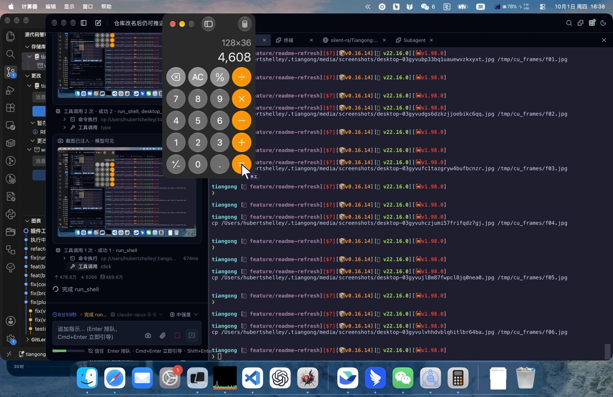
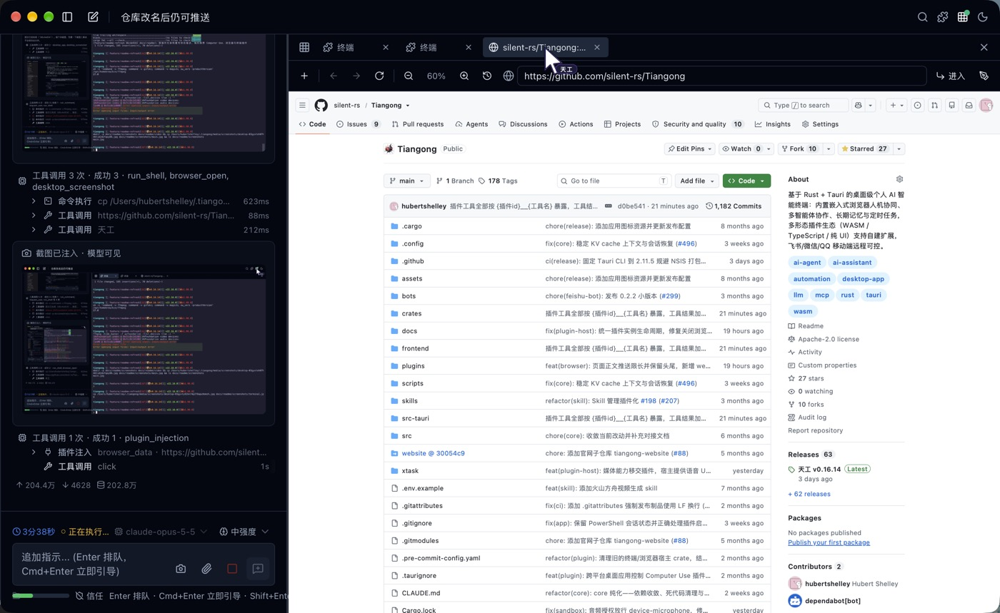
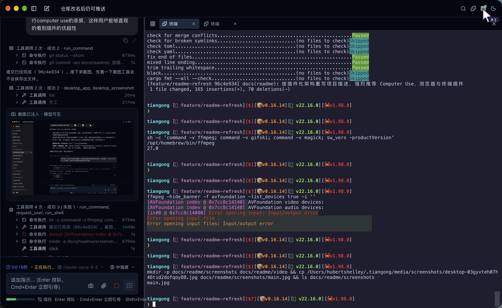
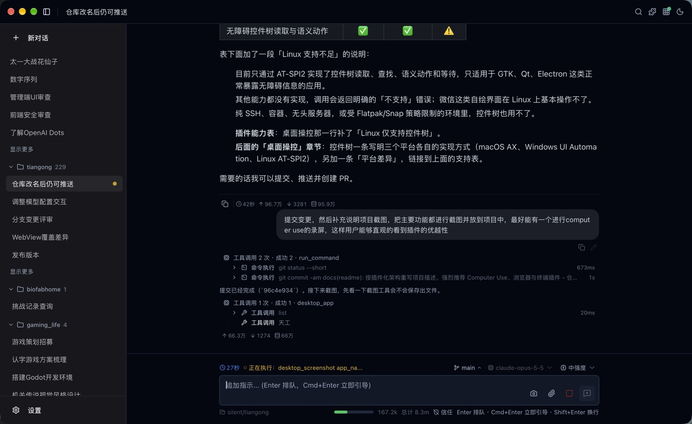
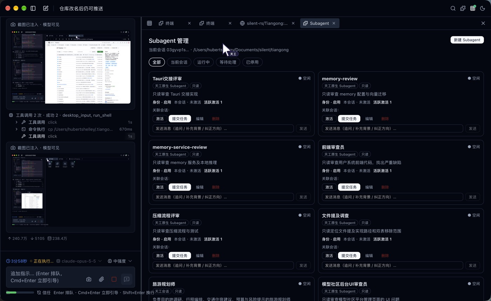
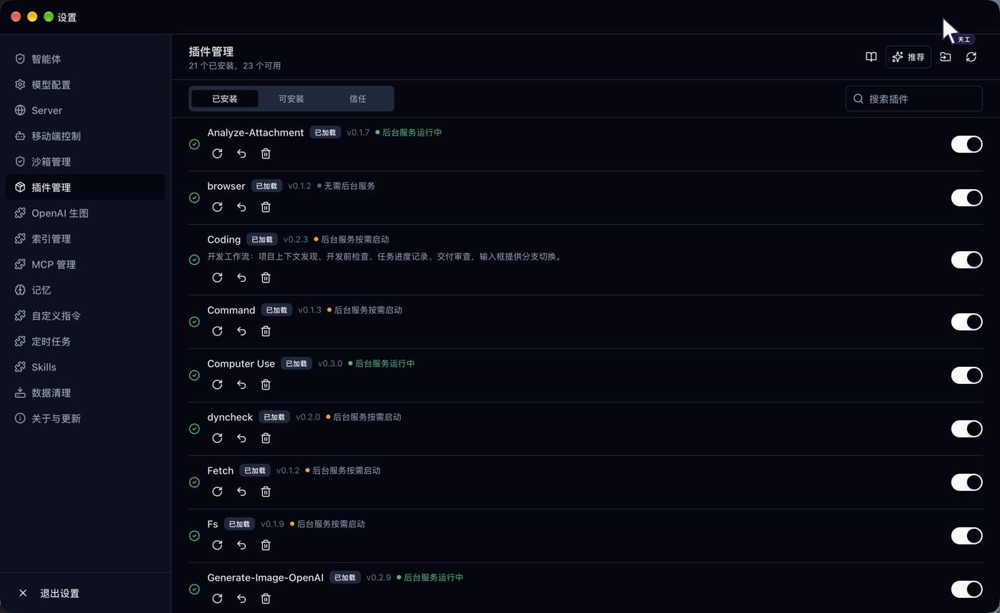
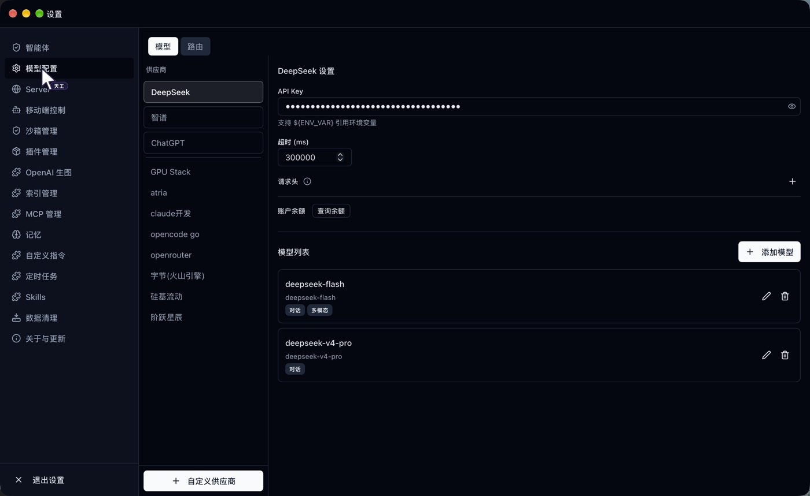

# Tiangong（天工）

[](LICENSE)
[](https://github.com/silent-rs/Tiangong/releases)
[](https://github.com/silent-rs/Tiangong/actions/workflows/ci.yml)

> 以插件为核心的个人 AI Agent 宿主：主程序负责 Agent 循环、模型接入、插件运行时与沙箱，文件、命令、浏览器、桌面操控、记忆、多智能体、定时任务等能力均由插件提供。

天工是一个基于 Rust、Tauri 和 [silent](https://github.com/silent-rs/silent) 构建的个人智能终端，以桌面应用为核心形态，同时提供 CLI 与 Server 等无界面运行方式接入脚本、服务或外部消息通道。主程序本身只保留通用骨架：会话与 ReAct 循环、模型 Provider、插件注册与路由、权限与沙箱边界、桌面界面与扩展挂载点，以及 Bot 托管、Webhook 等外部接入通道；Agent 能做什么，取决于安装和启用了哪些插件。

官方插件覆盖了日常工作所需的主要能力：读写文件、执行命令和终端、操作嵌入式浏览器、唤起并操控桌面应用、长期记忆、持久 Subagent 协作、定时与触发等。插件同时可以向 Agent 声明工具、向用户贡献界面，让人与 Agent 在同一工作环境中协作；用户也可以在天工内直接创建自己的插件。

> **强烈推荐安装 Computer Use、嵌入式浏览器和嵌入式终端三个插件**，其中 **Computer Use** 能让 Agent 直接操作微信、飞书、系统设置等任意桌面应用，是天工最值得体验的能力（目前在 macOS 与 Windows 上完整可用，Linux 支持不足）。详见 [强烈推荐的插件](#强烈推荐的插件)。

模型接入由主程序提供：适配 DeepSeek 的上下文缓存机制和 V4 新版接口（`deepseek-v4-pro` / `deepseek-v4-flash`），支持思考模式分档、结构化与文本协议双通道工具调用解析以及流式 KV cache 命中率统计；支持用 ChatGPT 账号（Codex OAuth）登录直接调用 GPT 系列模型，无需 API Key；会话内可随时切换模型，切换前自动整理上下文。推荐使用 [DeepSeek](https://www.deepseek.com/)、[Kimi](https://kimi.com/)、[智谱](https://www.bigmodel.cn/) 和 ChatGPT，其他模型可通过自定义供应商接入（支持 OpenAI Chat Completions、OpenAI Responses、Anthropic 协议）。

> 安全提示：天工默认通过独立 Sandbox Launcher 隔离插件 Sidecar 和按需命令进程。Launcher 分别使用 macOS Seatbelt、Linux bubblewrap、Windows AppContainer 与 Job Object 施加系统级边界；程序缺失、签名无效、自检失败或协议不兼容时拒绝启动受保护进程，不会静默降级。用户可以在「设置 → 沙箱管理」中查看状态、更新 Launcher，并按需配置额外允许目录和环境变量黑名单。关闭按需进程沙箱后，对应进程将以当前用户权限运行，请谨慎操作。


## 强烈推荐的插件

天工的能力取决于装了哪些插件。下面三个官方插件让 Agent 能直接看到、操作你的电脑，**强烈推荐安装**；其中 **Computer Use 是天工最有特色的插件，建议首先安装**。安装方式：「设置 → 插件管理」中从官方目录安装并启用。

### 首推：Computer Use（`computer-use`），让 Agent 操作任意桌面应用

浏览器和终端之外，大量工作发生在原生应用里：微信、飞书、系统设置、设计工具、各类自绘界面的客户端。Computer Use 让 Agent 像人一样操作这些应用，而不局限于网页和命令行：

- **一句话唤起**：按应用名（支持「微信」这类中文名）唤起或启动应用，自动与天工窗口分屏，你在一侧对话、Agent 在另一侧操作，随时可以接管；输入区「恢复窗口」按钮一键还原布局。
- **看得见界面**：截取窗口、区域或全屏并直接作为图片注入模型上下文，坐标可直接换算为点击位置，不依赖控件是否暴露无障碍信息。
- **真实键鼠操作**：系统级键鼠合成，支持点击、双击、拖拽、滚动、文本输入（中文不经输入法）和组合键；操作后可自动截图确认结果。
- **过程可见**：天工虚拟指针从系统鼠标位置分身出现并演示每一步操作，按键以 HUD 卡片显示，Agent 做了什么一目了然。
- **语义控件操作**：原生控件可读取无障碍控件树，执行按下、聚焦、赋值、勾选等语义动作，比坐标点击更稳。

平台支持：

| 能力                         | macOS | Windows | Linux |
| ---------------------------- | :---: | :-----: | :---: |
| 唤起 / 启动应用              | ✅    | ✅      | ❌    |
| 自动分屏与恢复窗口           | ✅    | ✅      | ❌    |
| 截图注入模型上下文           | ✅    | ✅      | ❌    |
| 键鼠输入（点击、拖拽、键入） | ✅    | ✅      | ❌    |
| 虚拟指针与按键 HUD           | ✅    | ✅      | ❌    |
| 无障碍控件树读取与语义动作   | ✅    | ✅      | ⚠️    |

> **Linux 支持不足**：目前只通过 AT-SPI2 实现控件树读取、查找、语义动作和等待，适用于 GTK、Qt、Electron 等正常暴露无障碍信息的应用。应用唤起、截图、键鼠输入、自动分屏和虚拟指针都还没有实现，调用会返回明确的「不支持」错误；微信等自绘界面应用在 Linux 上基本无法操作。没有 accessibility bus 的环境（纯 SSH、容器、无头服务器）或受 Flatpak/Snap 策略限制时，控件树能力同样不可用。

macOS 首次使用需授予天工「辅助功能」与「屏幕录制」权限。

典型用法：

```text
帮我打开微信，把「项目群」今天的消息总结一下
在系统设置里把显示器切到深色模式
打开飞书日历，看看我明天下午有哪些会
```

演示：让 Agent 打开「计算器」算出 128 × 36。Agent 唤起应用、清零、逐个点击按键并输入数字，每一步都截图确认，天工虚拟指针全程显示操作位置（点击图片查看演示视频）：

[](docs/readme/video/computer-use-calculator.mp4)

### 嵌入式浏览器（`browser`）：与你共用同一个页面

- Agent 可打开网页、读取正文（超长页面保留头尾，按需分段读取或关键词搜索）、查询 DOM、填写表单、点击元素。
- 浏览器就在天工拓展区里，你和 Agent 看的是同一个页面：你手动浏览、登录、点击时，Agent 能感知页面变化并接着做。
- 适合需要登录态的后台、资料检索、表单填写和网页上的重复操作。



### 嵌入式终端（`terminal`）：命令执行全程可见

- Agent 执行命令和脚本走真实 PTY 终端，输出实时显示在拓展区终端标签里，长任务也能随时查看进度。
- 终端跟随会话隔离，自动复用空闲终端；支持交互式程序，可向指定终端继续发送输入。
- 你也可以直接在同一个终端里手动操作，与 Agent 交替使用；命令同样受沙箱边界约束。



## 界面预览

| 主界面：对话、工具过程与运行状态 | 持久 Subagent 管理 |
| --- | --- |
|  |  |
| **插件管理：安装、启停与后台服务状态** | **模型配置：多供应商与 ChatGPT 账号** |
|  |  |

## 项目起源

天工源于一个朴素的想法：让 AI 从对话工具成长为真正参与个人工作流的智能终端。它不仅理解需求，也能围绕真实工作区读取资料、规划步骤、调用工具、操作网页、执行任务，并把过程和结果清晰地呈现给用户。

我们希望人与 Agent 不是简单的“下达任务并等待”，而是在同一个工作环境中持续协作。用户可以随时观察进度、接管操作、补充信息或调整方向；Agent 也能感知这些变化并继续推进。嵌入式浏览器、可视化工具过程和多智能体协作，都是这一理念的自然延伸。

天工面向的不只是编程，而是资料整理、研究分析、内容创作、网页操作、日常自动化和远程协作等广泛场景。能力通过插件持续扩展，模型可以自由配置，重要数据保存在本地，执行过程由明确的权限和沙箱边界约束。

整个项目以 Rust 为基础，优先追求本地运行、可扩展、可治理和长期可维护，让个人能够建立属于自己的 AI 工作中枢。

## 能力构成

天工的能力分为两层：主程序提供的宿主能力，以及在其上运行的插件能力。

**宿主能力**（主程序内置）：

| 能力         | 说明                                                                                                   |
| ------------ | ------------------------------------------------------------------------------------------------------ |
| Agent 循环   | 会话与工作区上下文装配、ReAct 推理与工具调用、上下文压缩，结构化事件推送到桌面与无界面入口             |
| 模型接入     | DeepSeek V4、ChatGPT 账号（Codex OAuth）、Anthropic 及 OpenAI 兼容供应商，会话级模型切换自动整理上下文 |
| 插件运行时   | 插件注册、清单校验、事务安装、签名信任、工具命名与路由、UI 挂载点、Sidecar 生命周期管理                |
| 沙箱与权限   | 独立 Sandbox Launcher 隔离 Sidecar 与按需命令；桌面会话可在监督模式和信任模式之间切换                  |
| 桌面与入口   | Tauri + React + shadcn/ui 桌面界面，以及 CLI、HTTP/WebSocket Server（含 Webhook 触发）等无界面入口      |
| 移动端控制   | 托管独立 Bot 制品接入飞书、微信、QQ，负责下载、配置、启停、监控与升级                                  |
| 发布更新     | GitHub Release 分发安装包（macOS 已签名并公证），桌面设置页和 `tiangong update` 共用在线更新链路       |

**插件能力**（官方插件提供，可按需安装与启停）：

| 能力          | 插件            | 说明                                                                                     |
| ------------- | --------------- | ---------------------------------------------------------------------------------------- |
| 文件与命令    | `fs`、`command`、`terminal` | 读写工作区文件、执行受控命令、多标签嵌入式终端（**推荐**）                    |
| 嵌入式浏览器  | `browser`       | 多标签浏览器，Agent 可浏览网页、读取正文、点击元素、填写表单，用户也可手动操作（**推荐**） |
| 桌面操控      | `computer-use`  | 唤起桌面应用并自动分屏，截图观察界面，用系统级键鼠和无障碍控件树操作原生应用（**首推**；Linux 仅支持控件树） |
| 多智能体协作  | `subagent`      | 持久 Subagent 拥有独立身份、指令与记忆，可按需招募、激活并派发带完成条件的任务           |
| 长期记忆      | `memory`        | 检索、反刍与工作区隔离，支持内置本地推理模型，也可作为 MCP / HTTP 服务独立运行           |
| 定时与触发    | `scheduler`     | Cron 定时任务，可关联会话复用上下文，结果可推送到 Bot 通道                               |
| 扩展接入      | `mcp`、`skill`、`prompt` | 接入 MCP Server、Skill 技能与自定义提示词                                       |
| 开发与创作    | `coding`、`plugin-creator` | 开发工作流检查与交付审查；在对话中创建、构建并安装自建插件                    |

完整插件列表与插件形态见下文 [插件系统](#插件系统)。

## 插件系统

天工的 Agent 能力全部以插件形式提供并独立演进，主程序只负责运行时、路由与边界。插件通过清单声明入口、权限与能力，运行在受控运行时中与主程序解耦。支持多种插件形态，覆盖从纯界面到带原生 sidecar 的完整场景：

| 形态                 | 适用                                                         |
| -------------------- | ------------------------------------------------------------ |
| 纯 UI 插件           | 面板、工具页、输入区动作，标准前端工程（推荐 Vue 3 + Vite）  |
| TypeScript 工具插件  | 带 UI 的工具提供器、审批与用户征询                           |
| Node sidecar 插件    | 常驻或按需 Node 进程提供工具能力，可带拓展区页面，也可无界面   |
| WASM 逻辑层插件      | 工具、提示词、生命周期与原生 sidecar                         |
| 混合插件             | UI 挂载 + WASM/sidecar 能力组合                              |

- **人机协同**：插件延续天工的人机协同理念，同一个插件既可以向 Agent 声明工具能力，也可以向用户贡献界面与交互（拓展区 App、输入区动作、输入覆盖层、审批与用户征询），让插件成为人与 Agent 共用的协作界面，而不是单向的自动化工具。
- **工具命名与展示**：插件工具统一以 `{插件id}__{工具名}` 暴露给模型，描述标注来源插件，同名工具不再互相覆盖；工具结果抬头和工具行图标（`plugin.json` 的 `tool_icons`）均由插件提供。
- **权限与能力声明**：插件在清单中声明 `entrypoints`、`permissions` 与 `capabilities`，主程序按声明路由请求；实际会话工作区和执行策略由宿主根据调用上下文确定，插件载荷不能自行扩大权限。
- **进程隔离**：WASM 逻辑由 Wasmtime 能力边界约束，Sidecar 默认通过 stdio 与宿主通信并由 Sandbox Launcher 启动；命令名称、参数文本不再作为安全边界，最终访问范围由操作系统沙箱实施。
- **独立签名发布**：每个插件单独构建、签名和发布，CI 校验签名清单与目录结构，支持默认插件推荐、安装进度展示、按需启停与更新，失败不影响主进程稳定性。
- **自建插件**：[`@silent-ai/plugin-creator`](plugins/devkit) 提供 ui-app / ts-tool / ts-npx / node-sidecar / node-tool 五种工程模板，也可用 `cargo run -p xtask -- new-plugin <id>` 生成纯 UI 最小骨架；构建产物经「设置 → 插件管理 → 导入本地插件」走正式安装链路（清单校验 → 事务安装 → 注册表加载）。官方 Plugin Creator 插件支持在对话中直接创建、构建、签名并安装插件，安装后当前会话即可通过 `call_local_plugin` 动态调用，无需新开会话。

官方插件一览：

| 类别       | 插件                                                                                     |
| ---------- | ---------------------------------------------------------------------------------------- |
| 基础工具   | `fs` 文件、`command` 命令、`terminal` 终端、`fetch` 网络请求、`index` 工作区索引         |
| 交互与界面 | `browser` 浏览器、`computer-use` 桌面操控、`interaction` 用户征询、`screenshot-input` 截图输入 |
| Agent 能力 | `memory` 长期记忆、`subagent` 多智能体、`scheduler` 定时与触发、`skill` 技能、`mcp` MCP 接入、`prompt` 提示词 |
| 开发与多媒体 | `coding` 开发工作流、`plugin-creator` 插件创作、`generate-image-openai` 生图、`analyze-attachment` 图片分析 |

插件源码位于根目录 [`plugins/`](plugins/)，编写自己的插件请参考 [插件开发指南](docs/plugin-development.md)。

## 沙箱与执行边界

天工将“执行命令”和“限制命令能做什么”拆成两个职责：Command 插件负责参数解析、受控环境、超时取消、进程清理和输出处理；Runtime 根据权威会话工作区和用户设置生成策略，独立 Sandbox Launcher 负责验证并施加操作系统隔离。这样不依赖命令名称白名单或 Shell 文本猜测，脚本和子进程也会继承同一执行边界。

- **跨平台实现**：macOS 使用 Seatbelt，Linux 使用 bubblewrap，Windows 使用 AppContainer 与 Job Object。
- **默认开启**：按需 Sidecar 默认进入沙箱；用户可显式关闭按需进程沙箱，变更在下次创建进程时生效。预加载的常驻服务不接受该开关降级。
- **工作区隔离**：Runtime 按工具调用所属会话读取真实工作区，不信任插件页面或调用参数自行声明的工作区。
- **用户授权**：在「设置 → 沙箱管理」中可以增加任意目录白名单，并维护不传给进程的环境变量黑名单。
- **管理面保护**：应用配置、签名密钥、信任库、Launcher 程序与授权配置由宿主强制保护，用户目录白名单不能覆盖这些保护项。
- **可信启动**：Launcher 在线安装并独立更新，每次使用前检查签名、自检结果及协议兼容性；不满足要求时受保护进程拒绝启动，但对话和浏览等不依赖 Launcher 的功能仍可使用。
- **必要例外**：官方签名的 Terminal 和 Command 可获得完成 Git 工作流所需的凭据只读能力；macOS 官方 `computer-use` 为继承应用辅助功能授权采用受控直启。第三方或同名自签插件不能获得这些例外。

Sandbox Launcher 也可作为独立程序使用，平台能力、策略格式和更新方式见 [`tiangong-sandbox` 说明](crates/tiangong-sandbox/README.md)。

## 多智能体协作（`subagent` 插件）

持久 Subagent 适合资料搜集、代码实现、测试验证、方案评审等需要长期身份、跨会话上下文与任务跟踪的工作。Subagent 统一由官方 `subagent` 插件管理，提供三种运行后端：原生 Subagent（默认，系统为其建立专属会话并跨任务延续上下文）、关联已有天工会话、受管 CLI 进程；在任意会话中激活后绑定当前 Workspace。

> 内置的进程内 Agent Team 已移除，多智能体协作统一由 `subagent` 插件提供。升级后如未安装该插件，可在设置的「插件管理」页从官方目录安装；旧会话中已保存的 Agent 消息与事件仍可只读查看。

```text
在扩展区或对话中创建 / 选择持久 Subagent
    ↓
在当前会话激活并绑定 Workspace
    ↓
发送普通消息或提交有完成条件的正式任务
    ↓
完成、阻塞或失败通过可靠反馈返回发起会话
```

已支持的能力：

- AI 在对话中用 `create_agent` 工具直接招募成员：同名复用并延续指令与记忆，默认创建后立即激活，可马上派活。
- 长期身份、职责指令、记忆文件和历史产物独立保存；成员完成任务后可自行沉淀经验与追加长期指令。
- 成员之间可直接发送协作消息组成集群，并维护各自的工作规划、背景约定与当前任务。
- 只读、独占写和隔离 worktree 三种 Workspace 策略，同一 Workspace 同时只有一个写入者。
- 管理页统一查看激活关系、待处理工作、任务、运行状态、事件和记忆。

详细设计见 [RFC 0011：多智能体协作系统](docs/rfc/0011-multi-agent-collaboration.md)；后续能力以 `subagent` 插件形式迭代。

## 嵌入式浏览器（`browser` 插件）

官方 `browser` 插件提供基于系统 WebView 的多标签浏览器，宿主负责 WebView 容器与标签生命周期，支持 Agent 自主浏览和用户手动操作两种模式协同工作：

- **Agent 自主浏览**：Agent 可通过 `web_fetch` 打开网页读取正文，超长正文保留头尾、中间省略，需要细节时用 `web_page_text` 分段读取或关键词搜索；还可查询 DOM、提取并填写表单、点击元素。
- **用户手动操作**：用户在浏览器中浏览、点击、输入时，Agent 通过页面快照感知用户行为，结合对话内容给出上下文相关的建议。
- **浏览历史**：支持全局浏览历史和标签页内前进/后退导航，历史记录持久化存储。
- **智能感知**：只有引起页面变化（URL 切换、内容更新）时才注入变化内容，快照在队列中只保留最新一条，避免过程数据重复干扰对话。

## 桌面操控（`computer-use` 插件）

官方 `computer-use` 插件让 Agent 能操作浏览器之外的原生桌面应用，适合微信、系统设置、自绘界面等无法通过网页或命令完成的场景：

- **应用唤起与分屏**：按应用名唤起或启动目标应用，并自动与天工窗口分屏；输入区提供「恢复窗口」按钮，一键还原天工窗口。
- **截图观察**：按窗口、区域或全屏截图并直接注入模型上下文，按逻辑尺寸缩放，坐标可直接换算为点击位置。
- **真实输入**：系统级键鼠合成（macOS CGEvent / Windows SendInput），支持点击、拖拽、滚动、文本输入和组合键，操作过程以虚拟指针和按键 HUD 可视化展示。
- **控件树**：原生控件可读取无障碍树并执行按下、聚焦、赋值等语义动作（macOS AX、Windows UI Automation、Linux AT-SPI2）。
- **平台差异**：以上能力在 macOS 与 Windows 上完整可用；Linux 目前仅支持控件树，唤起、截图、键鼠、分屏均未实现，详见 [强烈推荐的插件](#强烈推荐的插件) 中的平台支持表。

相关设计见 [`docs/computer-use/`](docs/computer-use/README.md)。

## 移动端控制（宿主 + Bot 制品）

天工通过独立 Bot 制品接入第三方 IM 平台，实现移动端远程控制：宿主（`tiangong-bots`）负责下载、配置、启动、监控和升级 Bot，Bot 通过 Server API 与天工通信。平台专属的扫码授权和凭证存储完全由对应 Bot 制品负责，天工只接收运行状态。

- **已支持平台**：飞书、微信、QQ，并支持本地自有 Bot 接入与第三方 Bot 目录贡献。
- **扫码配置**：桌面端调用 Bot 制品发起扫码，展示授权二维码与状态；扫码所得凭证由 Bot 自行保存，天工不接触明文。
- **运行托管**：Bot 随天工自动运行或手动启停，支持日志查看、配置删除、自动注入天工服务地址和 Token，Windows 停止时抑制终端窗口闪现。
- **MCP 主动推送**：Bot 自动维护已授权主动发过消息的多目标清单，具备文本、图片和文件推送能力，MCP 注册和注销绑定到 Bot 启停流程。
- **远程管理**：通过 `tiangong bot` 子命令可在无图形界面环境下完成 Bot 的全生命周期管理。

## 定时与触发

定时任务由 `scheduler` 插件提供（底层基于 `tiangong-scheduler` crate），Webhook 触发由 Server 内置，两者都用于按计划或外部事件驱动 Agent 执行：

- **定时任务**：JSON 文件存储（`~/.tiangong/scheduler/`），复用 silent 框架内置 Scheduler，Server 启动时自动恢复已启用的 Cron Job。
- **双模式编辑**：桌面端提供简单模式和 Cron 模式两种编辑器，内置校验和下次触发预览，可关联已有会话复用上下文或自动创建新会话。
- **Webhook 触发**：Server 内置独立于定时任务的 HTTP 触发能力（`~/.tiangong/webhooks/`），提供无需认证的外部触发端点和需认证的管理端点，支持可选签名验证。
- **结果推送**：定时任务和 Webhook 触发的结果可推送到指定 Bot 通道，与移动端控制联动。

## 架构

天工采用 Cargo workspace 多 crate 结构：`crates/` 为宿主（核心引擎、运行时与各入口），`plugins/` 为独立构建、签名与发布的插件：

```text
crates/
  tiangong-types/          公共类型、消息、会话、任务状态和流事件
  tiangong-config/         配置加载、持久化和日志初始化
  tiangong-llm/            LLM 协议抽象与 Provider（OpenAI / Responses / Codex 等）
  tiangong-anthropic/      Anthropic Messages API 与 SSE 适配
  tiangong-deepseek/       DeepSeek API 异步客户端（对话、Responses、文件、余额）
  tiangong-core/           Agent 循环、工具调用、上下文压缩、插件扩展点
  tiangong-core-manager/   会话级 Core 注册表、模型切换与资源管理
  tiangong-app-state/      进程内应用状态聚合
  tiangong-media-archive/  输入附件本地归档
  tiangong-bots/           移动端控制：Bot 制品下载、配置、启停和监控
  tiangong-scheduler/      定时任务（Cron）与 Webhook 触发
  tiangong-cli/            CLI / TUI 前端
  tiangong-entry/          统一命令入口
  tiangong-server/         HTTP REST + WebSocket Server
  tiangong-plugin-runtime/ 插件注册、宿主策略、工具命名、Sidecar 路由与 Launcher 管理
  tiangong-plugin-sidecar/ 插件 Sidecar 通用运行库（单例选举、IPC、退出信号）
  tiangong-sandbox/        跨平台 Sandbox Launcher、策略、验签、自检与更新
  tiangong-toolkit/        插件共享的路径、进程和输出辅助能力
plugins/                   官方插件（多数由 protocol / wasm / sidecar 三个 crate 组成）、
                           插件 SDK、devkit 与模板
bots/                      飞书、微信、QQ Bot 制品
frontend/                  桌面前端（React + shadcn/ui）
src-tauri/                 Tauri 桌面壳
xtask/                     插件构建、打包与脚手架任务
```

核心执行流程：

```text
用户输入
  ↓
会话与工作区上下文装配
  ↓
ReAct 循环：推理、工具调用、观察、继续执行
  ↓ 工具调用
Runtime 根据所属会话和用户设置生成执行策略
  ↓
Sidecar 经 Launcher 进入系统沙箱并通过 stdio 与宿主通信
  ↓ 工具结果返回 ReAct 循环
默认由主 Agent 直接完成；用户要求分工时招募 Subagent 协作
  ↓
结构化事件实时推送到桌面界面与无界面入口
```

## 安装

### 从发布包安装

在 [GitHub Releases](https://github.com/silent-rs/Tiangong/releases) 下载当前系统对应的安装包：

- macOS：下载 `.dmg`，打开后将「天工」拖入「应用程序」目录。
- Windows：下载 `.msi` 或 `.exe`，按安装向导完成安装。
- Linux：下载 `.AppImage`、`.deb` 或 `.rpm`，按发行版习惯安装或直接运行。

macOS 安装包已接入 Developer ID 签名与 Apple 公证，可直接打开。

### Linux 服务器安装

在无桌面环境的服务器上（VPS、云主机、Docker 容器），推荐通过源码编译获得纯 CLI/Server 二进制（不依赖 WebKit/GTK 等桌面运行时）：

```bash
# 安装编译依赖（Debian/Ubuntu）
sudo apt-get install -y build-essential pkg-config protobuf-compiler libssl-dev ca-certificates curl

# 安装 Rust
curl --proto '=https' --tlsv1.2 -sSf https://sh.rustup.rs | sh && source "$HOME/.cargo/env"

# 编译
git clone https://github.com/silent-rs/Tiangong.git && cd Tiangong
cargo build --release
sudo install -m 0755 target/release/tiangong /usr/local/bin/tiangong
```

服务端通过模块化 CLI 完成无界面配置（详见 [`docs/linux-server-deployment.md`](docs/linux-server-deployment.md)）：

```bash
tiangong model add-provider deepseek --protocol deepseek --base-url https://api.deepseek.com --api-key-env DEEPSEEK_API_KEY
tiangong model add-model deepseek-v4-pro --provider deepseek --model-id deepseek-v4-pro --capability chat
tiangong model route set chat deepseek-v4-pro
tiangong server config set --host 127.0.0.1 --port 8080
tiangong server token generate
tiangong doctor
tiangong server -d
```

### 命令行入口

桌面安装包内包含同一个 `tiangong` 入口，可用于更新、诊断和后台服务。macOS 可创建软链接：

```bash
ln -s /Applications/天工.app/Contents/MacOS/天工 /usr/local/bin/tiangong
```

Windows 可将安装目录加入 `PATH`。Linux 安装包通常会直接提供可执行入口。

## 使用

天工以桌面应用为主要使用方式，模型配置、插件安装、会话管理与沙箱管理均可在设置页完成。首次启动时若 Sandbox Launcher 尚未就绪，应用会尝试从官方清单安装并验证；安装失败不会阻塞对话，但依赖沙箱的工具会拒绝执行，可稍后在「设置 → 沙箱管理」中重试。源码运行时默认启动桌面应用：

```bash
cargo run --release
```

需要接入外部系统或在无桌面环境运行时，同一入口也提供无界面运行方式（详见 [Linux 服务器部署指南](docs/linux-server-deployment.md)）：

```bash
tiangong server -d        # 后台启动 Server
tiangong server stop      # 停止后台 Server
tiangong update --check   # 检查更新
```

**更新机制**：桌面应用通过设置页或 `tiangong update` 自动下载安装更新；无界面二进制（Linux 服务器）当前需重新编译或下载新版本二进制替换（`tiangong update --check` 仅检查版本不自动安装）。配置独立存储在 `~/.tiangong/`，更新二进制不丢失配置。

### 模块化配置（0.12.0+）

无桌面环境可通过 CLI 完成与桌面设置页等价的分模块配置（设计详见 [RFC 0015](docs/rfc/0015-cli-modular-config.md)）：

```bash
tiangong model list                      # 查看模型配置
tiangong model route set chat deepseek-v4-pro  # 切换 chat 模型
tiangong model chatgpt login             # 登录 ChatGPT 账号（加 --device 使用设备码）
tiangong server token show               # 查看 Server Token
tiangong memory enable                   # 启用 Memory
tiangong prompt edit                     # 编辑自定义 Prompt
tiangong bot list                        # 查看已配置 Bot
tiangong bot start feishu                # 启动指定 Bot
tiangong config show                     # 配置概览
tiangong doctor                          # 环境诊断
```

## 配置

默认数据目录：

```text
~/.tiangong/
  models.json           模型配置：Provider + Model + Routing
  server.json           Server 监听配置（host/port/auth_token）
  custom-prompt.md      自定义 Prompt（独立文件，CLI 可直接编辑）
  skills.json           Skill 配置
  mcp.json              MCP 配置
  sessions/             会话持久化
  logs/                 运行日志
  media/                生成或归档的媒体文件
  memory/               长期记忆数据（含独立 config.json）
  auth/                 账号登录凭据（如 ChatGPT OAuth 令牌，默认禁止插件读取）
  plugins-dev/          自建插件开发目录
  sandbox/              Sandbox Launcher 与伴生签名
```

模型配置采用 Provider、Model、Routing 三层结构。`api_key` 支持 `${ENV_VAR}` 环境变量引用，便于避免明文保存密钥。自定义 Prompt 独立存储为 `custom-prompt.md`，可通过 `tiangong prompt` 命令管理。

详细的 Linux 服务器部署、systemd 托管、反向代理与更新策略见 [部署指南](docs/linux-server-deployment.md)。

## 开发

开发或本地调试插件前，请先阅读 [插件开发指南](docs/plugin-development.md)，了解插件形态、清单、构建、sidecar 接入和本地导入流程。

```bash
# Rust 检查
cargo check --workspace

# Rust lint
cargo clippy --workspace --all-targets --tests --benches -- -D warnings

# 格式化
cargo fmt

# 前端构建
yarn --cwd frontend build

# 完整检查链
cargo fmt -- --check && cargo check --workspace && cargo clippy --workspace --all-targets --tests --benches -- -D warnings && cargo nextest run --workspace --no-tests pass
```

前端开发使用 yarn：

```bash
yarn --cwd frontend install
yarn --cwd frontend dev
```

## 文档

- [插件开发指南](docs/plugin-development.md)
- [Plugin Creator / devkit](plugins/devkit/README.md)
- [Sandbox Launcher 使用说明](crates/tiangong-sandbox/README.md)
- [Computer Use 文档](docs/computer-use/README.md)
- [Memory 插件](plugins/tiangong-plugin-memory/README.md)
- [Bot 制品说明](bots/README.md)
- [CLI 配置指南](docs/cli-configuration-guide.md)
- [Server API](docs/server-api.md)
- [Linux 服务器部署指南](docs/linux-server-deployment.md)
- [Bot MCP 主动推送设计](docs/bot-mcp-proactive-push-design.md)
- [RFC 0011：多智能体协作系统](docs/rfc/0011-multi-agent-collaboration.md)
- [RFC 0015：CLI 模块化配置](docs/rfc/0015-cli-modular-config.md)

## 许可证

[Apache License 2.0](LICENSE)
